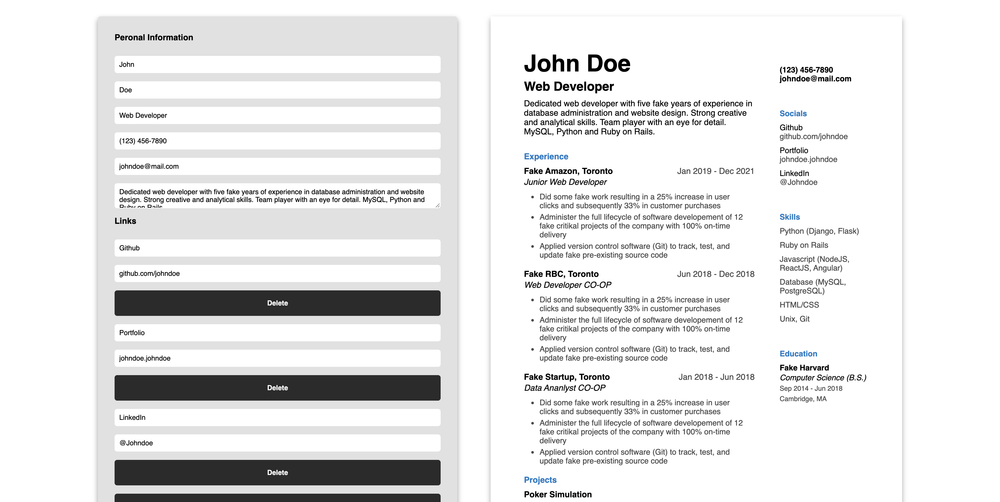

# Resume Builder

## Table of Contents
- [Introduction](#introduction)
- [Tech](#tech)
- [Features](#features)
- [Screenshots](#screenshots)
- [Future Implementations](#future-implementations)

## Introduction
Creating a resume can be quite tedious, but now that process can be streamlined with the use of <b>Resume Builder</b>!

## Tech
ReactJS, HTML/CSS

## Features
<ul>
  <li>Responsive inputs: <i>see your resume get built in realt-time!</i></li>  
  <li>Print/save your resume as PDF</li>  
  <li>Optimal layout, fonts, and font sizes</li>  
</ul>

## Screenshots
### Create

    

### Resume (PDF)

    

## Future Implementations
<ul>
  <li>Layout selection</li>  
  <li>Mobile optimization</i>
</ul>
